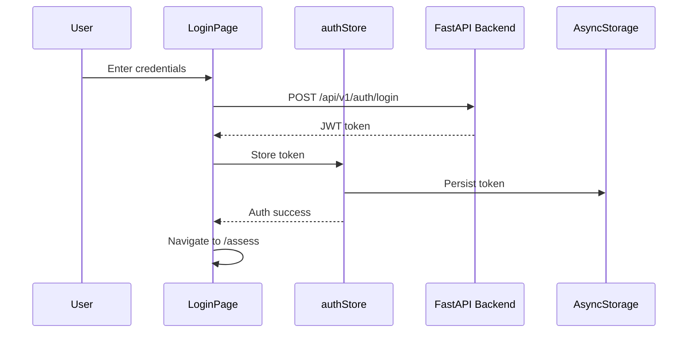

# MamaSafe Mobile App Design Specification

## Overview

This document specifies the design and architecture for the MamaSafe mobile app, a React Native (Expo) application that mirrors the existing web app's functionality while providing a native mobile experience with full offline support.

**Date:** 2026-07-15  
**Status:** Approved  
**Approach:** Minimal Setup (Expo Router + NativeWind + Zustand)

## 1. Project Context

### Current State
- **Web App**: React 19 + Vite + Tailwind CSS + React Router
- **Backend**: FastAPI + PostgreSQL + XGBoost ML model
- **Features**: Login, Assessment, Results, History, Dashboard
- **i18n**: English and French (87 translation keys)
- **Design**: Custom Tailwind theme with rose primary colors

### Goals
- Create a mobile app with identical functionality to the web app
- Maintain design consistency (same colors, typography, spacing)
- Connect to the same backend API
- Support full offline mode with sync
- Provide native mobile UX patterns

## 2. Technology Stack

| Layer | Technology | Rationale |
|-------|------------|-----------|
| **Framework** | Expo SDK 52 | Latest stable, good ecosystem |
| **Navigation** | Expo Router | File-based routing, simpler setup |
| **Styling** | NativeWind | Tailwind-like, matches web app |
| **State** | Zustand | Lightweight, modern, minimal boilerplate |
| **Persistence** | AsyncStorage + SQLite | Offline support |
| **API** | Axios | Same client as web app |
| **i18n** | i18next | Reuse web app's translations |
| **Testing** | Jest + React Native Testing Library | Industry standard |

## 3. Architecture

### 3.1 Folder Structure

```
mobile/
├── app/                    # Expo Router pages
│   ├── (auth)/            # Authentication group
│   │   ├── login.tsx      # Login page
│   │   └── _layout.tsx    # Auth layout
│   ├── (main)/            # Main app group
│   │   ├── assess.tsx     # Assessment form
│   │   ├── result.tsx     # Results display
│   │   ├── history.tsx    # History list
│   │   ├── dashboard.tsx  # Dashboard stats
│   │   └── _layout.tsx    # Main layout with tabs
│   └── _layout.tsx        # Root layout
├── components/            # Reusable components
│   ├── ui/               # UI primitives (Button, Input, Card)
│   ├── RiskBadge.tsx     # Risk level badge
│   ├── SHAPChart.tsx     # SHAP bar chart
│   └── LanguageToggle.tsx # EN/FR toggle
├── stores/               # Zustand stores
│   ├── authStore.ts      # Authentication state
│   ├── assessmentStore.ts # Assessment data
│   └── offlineStore.ts   # Offline queue management
├── services/             # API and storage
│   ├── api.ts            # Axios client (same as web)
│   ├── storage.ts        # AsyncStorage wrapper
│   └── syncService.ts    # Offline sync logic
├── i18n/                 # Internationalization
│   ├── index.ts          # i18next setup
│   ├── en.json           # English translations
│   └── fr.json           # French translations
├── theme/                # Design tokens
│   ├── colors.ts         # Color palette (matching web)
│   ├── typography.ts     # Font sizes/weights
│   └── spacing.ts        # Spacing scale
├── types/                # TypeScript types
│   └── index.ts          # Shared types
├── __tests__/            # Test files
│   ├── components/       # Component tests
│   ├── stores/           # Store tests
│   └── services/         # Service tests
├── app.json              # Expo config
├── package.json          # Dependencies
├── tsconfig.json         # TypeScript config
├── tailwind.config.js    # NativeWind config
└── jest.config.js        # Jest config
```

### 3.2 Component Architecture

#### Core Pages (Matching Web App)
1. **LoginPage** - Authentication form with brand logo, username/password fields, error handling
2. **AssessmentPage** - Patient vitals input form (6 clinical fields)
3. **ResultPage** - Risk result display with SHAP breakdown and probability bars
4. **HistoryPage** - Past assessments list with search/filter functionality
5. **DashboardPage** - Aggregate statistics with donut chart and stacked bar chart

#### Reusable UI Components
1. **Button** - Primary/secondary/ghost variants with loading states
2. **Input** - Text input with label, error message, and focus states
3. **Card** - Container with shadow and border radius
4. **RiskBadge** - Colored badge (red/amber/green) for risk levels
5. **SHAPChart** - Bar chart showing feature contributions
6. **LanguageToggle** - EN/FR toggle button
7. **NavBar** - Bottom tab navigation (mobile-native pattern)
8. **ProtectedRoute** - Auth guard component

#### Mobile-Specific Adaptations
- **Bottom Tab Navigation** instead of top navbar
- **Pull-to-refresh** on History and Dashboard pages
- **Swipe gestures** for navigation where appropriate
- **SafeAreaView** for notch/home indicator handling
- **KeyboardAvoidingView** for form inputs

## 4. Data Flow

### 4.1 Authentication Flow



### 4.2 Assessment Flow

```mermaid
sequenceDiagram
    participant U as User
    participant AP as AssessmentPage
    participant AS as assessmentStore
    participant API as FastAPI Backend
    participant DB as SQLite (local)
    participant OFF as offlineStore

    U->>AP: Fill vitals form
    AP->>AP: Validate inputs
    AP->>API: POST /api/v1/predict
    alt Online
        API-->>AP: Prediction result
        AP->>DB: Save assessment locally
        AP->>AP: Navigate to /result
    else Offline
        AP->>OFF: Queue assessment
        OFF->>OFF: Persist to AsyncStorage
        AP-->>U: "Saved offline, will sync later"
    end
```

### 4.3 Offline Sync Flow

```mermaid
sequenceDiagram
    participant OFF as offlineStore
    participant NET as Network Monitor
    participant API as FastAPI Backend
    participant DB as SQLite (local)

    loop When online
        NET->>OFF: Network available
        OFF->>OFF: Get queued items
        loop For each item
            OFF->>API: Sync item
            alt Success
                API-->>OFF: Confirm
                OFF->>OFF: Mark as synced
            else Conflict
                API-->>OFF: Conflict error
                OFF->>OFF: Mark as conflict
            end
        end
    end
```

### 4.4 Data Persistence Strategy

| Data Type | Storage | Rationale |
|-----------|---------|-----------|
| JWT Token | Zustand + AsyncStorage | Quick access, persistence |
| User Preferences | Zustand + AsyncStorage | Language, theme settings |
| Assessments | SQLite | Structured data, queries |
| Offline Queue | Zustand + AsyncStorage | Queue management |
| Translation Files | Static JSON | Bundle with app |

## 5. Design System

### 5.1 Color Palette (Matching Web App)

```typescript
// theme/colors.ts
export const colors = {
  // Primary (Rose)
  primary: '#E8637A',
  primaryHover: '#D4526A',
  primaryLight: '#FDF2F4',
  
  // Surface/Canvas
  surface: '#FFFFFF',
  canvas: '#FAFAFA',
  canvasAlt: '#F8F6FA',
  
  // Text
  textHeading: '#3D3847',
  textBody: '#5C5566',
  textMuted: '#8E8696',
  
  // Border
  border: '#E8E5EC',
  
  // Risk Colors
  riskHigh: '#EF4444',
  riskMid: '#F59E0B',
  riskLow: '#10B981',
  
  // Status
  success: '#10B981',
  error: '#EF4444',
  warning: '#F59E0B',
  info: '#3B82F6',
};
```

### 5.2 Typography

```typescript
// theme/typography.ts
export const typography = {
  // Font families
  fontFamily: {
    regular: 'Inter-Regular',
    medium: 'Inter-Medium',
    semibold: 'Inter-SemiBold',
    bold: 'Inter-Bold',
  },
  
  // Font sizes
  fontSize: {
    xs: 12,
    sm: 14,
    base: 16,
    lg: 18,
    xl: 20,
    '2xl': 24,
    '3xl': 30,
    '4xl': 36,
  },
  
  // Font weights
  fontWeight: {
    normal: '400',
    medium: '500',
    semibold: '600',
    bold: '700',
  },
};
```

### 5.3 Spacing

```typescript
// theme/spacing.ts
export const spacing = {
  xs: 4,
  sm: 8,
  md: 12,
  lg: 16,
  xl: 20,
  '2xl': 24,
  '3xl': 32,
  '4xl': 40,
  '5xl': 48,
};
```

### 5.4 Border Radius

```typescript
// theme/borderRadius.ts
export const borderRadius = {
  sm: 4,
  md: 8,
  lg: 12,
  xl: 16,
  '2xl': 20,
  full: 9999,
};
```

## 6. Offline Support

### 6.1 Offline Strategy

- **Queue-based sync**: All write operations queued when offline
- **Local storage**: SQLite for structured data, AsyncStorage for key-value
- **Conflict resolution**: Server data wins (latest assessment)
- **Sync indicators**: Show pending/synced status in UI

### 6.2 Network Monitoring

```typescript
// services/networkMonitor.ts
import NetInfo from '@react-native-community/netinfo';

export const networkMonitor = {
  subscribe: (callback: (isOnline: boolean) => void) => {
    return NetInfo.addEventListener(state => {
      callback(state.isConnected ?? false);
    });
  },
  
  isOnline: async () => {
    const state = await NetInfo.fetch();
    return state.isConnected ?? false;
  },
};
```

### 6.3 Offline Queue

```typescript
// stores/offlineStore.ts
interface OfflineQueueItem {
  id: string;
  action: string;
  payload: any;
  timestamp: number;
  status: 'pending' | 'synced' | 'conflict';
}
```

## 7. API Integration

### 7.1 API Client (Same as Web App)

```typescript
// services/api.ts
import axios from 'axios';
import AsyncStorage from '@react-native-async-storage/async-storage';

const API_URL = process.env.EXPO_PUBLIC_API_URL || 'http://localhost:8000';

const api = axios.create({
  baseURL: API_URL,
  headers: {
    'Content-Type': 'application/json',
  },
});

// Request interceptor to attach token
api.interceptors.request.use(async (config) => {
  const token = await AsyncStorage.getItem('token');
  if (token) {
    config.headers.Authorization = `Bearer ${token}`;
  }
  return config;
});

// Response interceptor for 401 errors
api.interceptors.response.use(
  (response) => response,
  async (error) => {
    if (error.response?.status === 401) {
      await AsyncStorage.removeItem('token');
      // Redirect to login
    }
    return Promise.reject(error);
  }
);

export default api;
```

### 7.2 API Endpoints

| Method | Endpoint | Auth | Description |
|--------|----------|------|-------------|
| POST | `/api/v1/auth/login` | No | OAuth2 password flow |
| POST | `/api/v1/auth/register` | Admin | Create new user |
| POST | `/api/v1/predict` | JWT | Run ML prediction |
| GET | `/api/v1/assessments` | JWT | List assessments |
| GET | `/api/v1/assessments/{id}` | JWT | Get single assessment |
| GET | `/api/v1/dashboard/summary` | JWT | Aggregate statistics |
| GET | `/health` | No | Health check |

## 8. Internationalization

### 8.1 i18n Setup

```typescript
// i18n/index.ts
import i18n from 'i18next';
import { initReactI18next } from 'react-i18next';
import AsyncStorage from '@react-native-async-storage/async-storage';
import en from './en.json';
import fr from './fr.json';

const languageDetector = {
  type: 'languageDetector' as const,
  async: true,
  detect: async (callback: (lng: string) => void) => {
    const stored = await AsyncStorage.getItem('lang');
    callback(stored || 'en');
  },
  init: () => {},
  cacheUserLanguage: async (lng: string) => {
    await AsyncStorage.setItem('lang', lng);
  },
};

i18n
  .use(languageDetector)
  .use(initReactI18next)
  .init({
    resources: {
      en: { translation: en },
      fr: { translation: fr },
    },
    fallbackLng: 'en',
    interpolation: {
      escapeValue: false,
    },
  });

export default i18n;
```

### 8.2 Translation Files

Reuse the same translation files from the web app:
- `frontend/src/i18n/en.json` → `mobile/i18n/en.json`
- `frontend/src/i18n/fr.json` → `mobile/i18n/fr.json`

## 9. Testing Strategy

### 9.1 Testing Tools

- **Jest**: Test runner and assertion library
- **React Native Testing Library**: Component testing utilities
- **Testing Library Jest Native**: React Native-specific matchers

### 9.2 Test Coverage Goals

| Category | Coverage Target |
|----------|-----------------|
| Components | 80% |
| Stores | 90% |
| Services | 80% |
| Utils | 90% |

### 9.3 Test Structure

```
__tests__/
├── components/
│   ├── Button.test.tsx
│   ├── Input.test.tsx
│   └── ...
├── stores/
│   ├── authStore.test.ts
│   └── ...
├── services/
│   ├── api.test.ts
│   └── ...
└── utils/
    └── ...
```

### 9.4 Example Test

```typescript
// __tests__/components/Button.test.tsx
import { render, fireEvent } from '@testing-library/react-native';
import Button from '../../components/ui/Button';

describe('Button', () => {
  it('renders correctly', () => {
    const { getByText } = render(
      <Button onPress={() => {}}>Click me</Button>
    );
    expect(getByText('Click me')).toBeTruthy();
  });

  it('calls onPress when pressed', () => {
    const onPress = jest.fn();
    const { getByText } = render(
      <Button onPress={onPress}>Click me</Button>
    );
    fireEvent.press(getByText('Click me'));
    expect(onPress).toHaveBeenCalledTimes(1);
  });

  it('shows loading state', () => {
    const { getByTestId } = render(
      <Button onPress={() => {}} loading>Loading</Button>
    );
    expect(getByTestId('loading-indicator')).toBeTruthy();
  });
});
```

## 10. Error Handling

### 10.1 API Error Handling

| Error Type | User Message | Action |
|------------|--------------|--------|
| Network error | "No internet connection" | Queue for sync |
| 401 Unauthorized | "Session expired" | Redirect to login |
| 422 Validation | Field-specific errors | Show in form |
| 500 Server | "Something went wrong" | Retry option |
| Timeout | "Request timed out" | Retry option |

### 10.2 Form Validation

- **Required fields**: Show error when empty
- **Range validation**: Age (10-100), Blood Pressure (60-250), etc.
- **Real-time validation**: Validate on blur
- **Submit validation**: Validate all fields before API call

### 10.3 Offline Error Handling

- **No network**: Show offline indicator, queue actions
- **Sync conflicts**: Show conflict resolution UI
- **Storage full**: Show warning, suggest cleanup
- **Data corruption**: Show recovery options

## 11. Dependencies

### 11.1 Core Dependencies

```json
{
  "expo": "~52.0.0",
  "expo-router": "~4.0.0",
  "expo-status-bar": "~2.0.0",
  "react": "18.3.1",
  "react-native": "0.76.0",
  "react-native-safe-area-context": "5.0.0",
  "react-native-screens": "~4.1.0",
  "nativewind": "^4.0.0",
  "zustand": "^5.0.0",
  "@react-native-async-storage/async-storage": "2.1.0",
  "@react-native-community/netinfo": "11.4.1",
  "axios": "^1.7.0",
  "i18next": "^24.0.0",
  "react-i18next": "^15.0.0",
  "react-native-chart-kit": "^6.12.0",
  "react-native-svg": "^15.0.0"
}
```

### 11.2 Dev Dependencies

```json
{
  "typescript": "~5.3.0",
  "@types/react": "~18.3.0",
  "jest": "^29.0.0",
  "@testing-library/react-native": "^12.0.0",
  "@testing-library/jest-native": "^5.4.0",
  "jest-expo": "~52.0.0"
}
```

## 12. Implementation Phases

### Phase 1: Setup (Day 1)
- Create mobile folder structure
- Initialize Expo project with TypeScript
- Install all dependencies
- Configure NativeWind, Jest, TypeScript
- Set up folder structure

### Phase 2: Core Infrastructure (Day 2-3)
- Implement Zustand stores (auth, assessment, offline)
- Set up API client with interceptors
- Configure i18n with translation files
- Create theme/design tokens
- Build reusable UI components

### Phase 3: Authentication (Day 4)
- Build LoginPage component
- Implement auth flow with JWT
- Add ProtectedRoute component
- Set up secure token storage

### Phase 4: Assessment Flow (Day 5-6)
- Build AssessmentPage with form validation
- Implement API integration for predictions
- Build ResultPage with SHAP chart
- Add offline queue for assessments

### Phase 5: History & Dashboard (Day 7-8)
- Build HistoryPage with search/filter
- Build DashboardPage with charts
- Add pull-to-refresh functionality
- Implement offline data display

### Phase 6: Polish & Testing (Day 9-10)
- Add error handling throughout
- Implement offline sync logic
- Write comprehensive tests
- Performance optimization
- Final QA and bug fixes

## 13. Success Criteria

1. **Feature parity**: All 5 pages functional and matching web app
2. **Design consistency**: Same colors, typography, spacing as web app
3. **Offline support**: Full offline mode with sync
4. **Performance**: Smooth 60fps animations, fast load times
5. **Testing**: 80%+ test coverage
6. **i18n**: English and French fully supported
7. **Backend integration**: Same API endpoints, same data format

## 14. Risks & Mitigations

| Risk | Impact | Mitigation |
|------|--------|------------|
| Offline sync conflicts | High | Server-wins strategy, conflict UI |
| Performance on old devices | Medium | Optimize renders, lazy loading |
| NativeWind compatibility | Low | Use StyleSheet fallback if needed |
| i18n bundle size | Low | Lazy load translations |

## 15. Future Enhancements

1. **Push notifications** for critical alerts
2. **Biometric authentication** (fingerprint/face)
3. **Camera integration** for scanning patient IDs
4. **Offline-first ML** (run model on device)
5. **Multi-language support** (add more Cameroonian languages)
6. **Analytics dashboard** for admin users
7. **Export reports** as PDF

---

**Document Version:** 1.0  
**Last Updated:** 2026-07-15  
**Author:** opencode  
**Status:** Approved for Implementation
